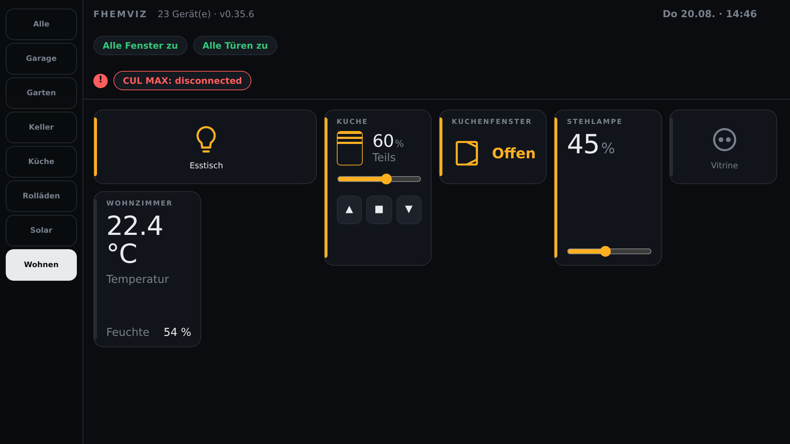
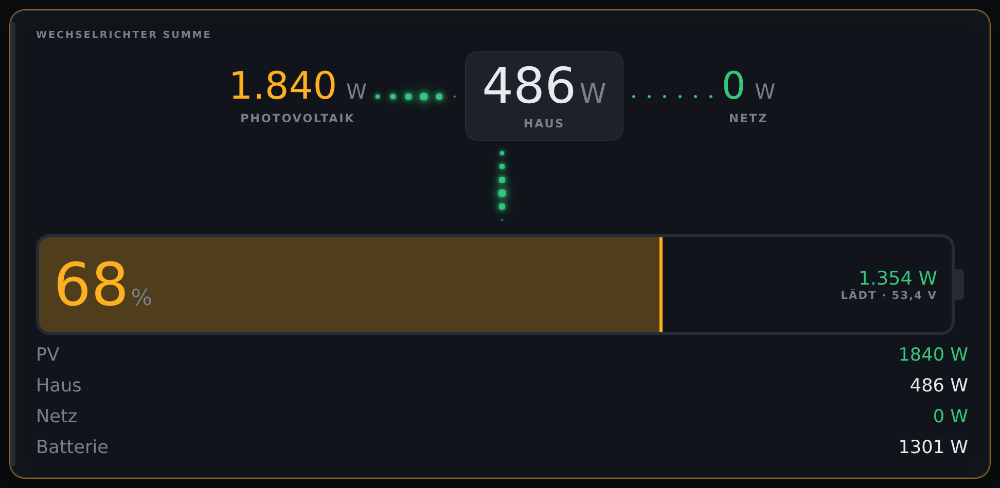
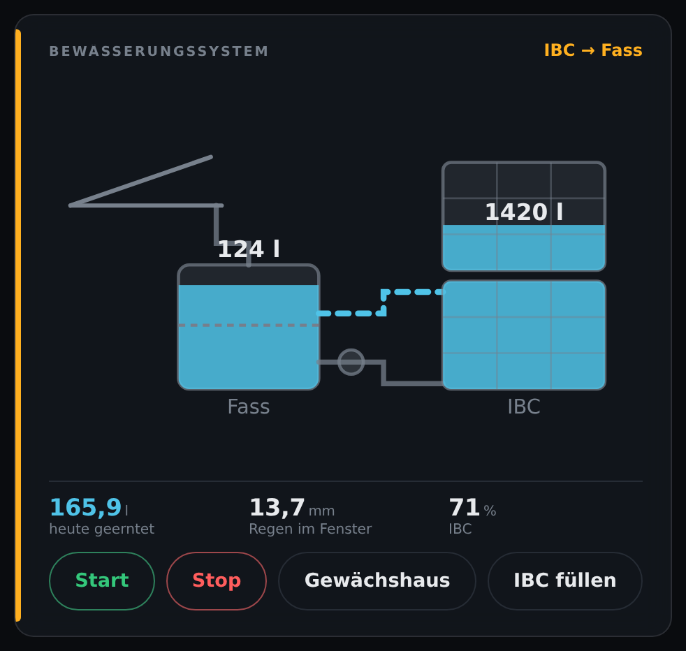
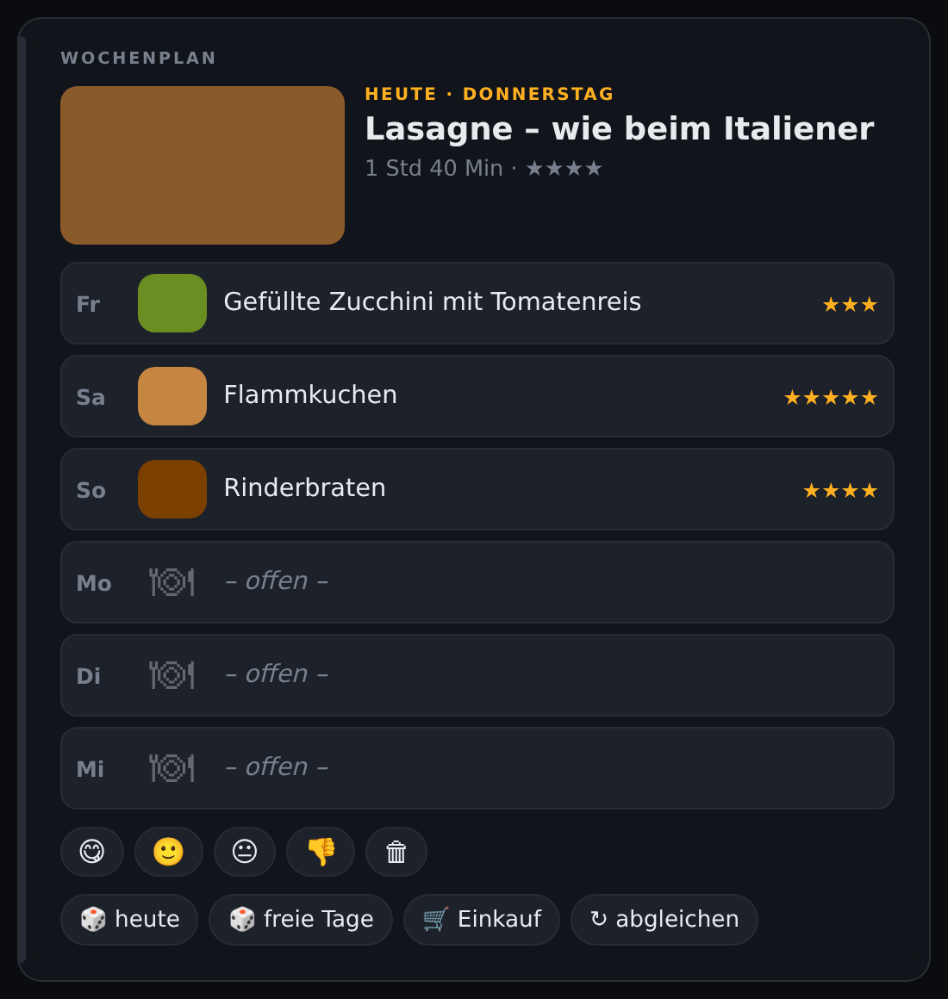
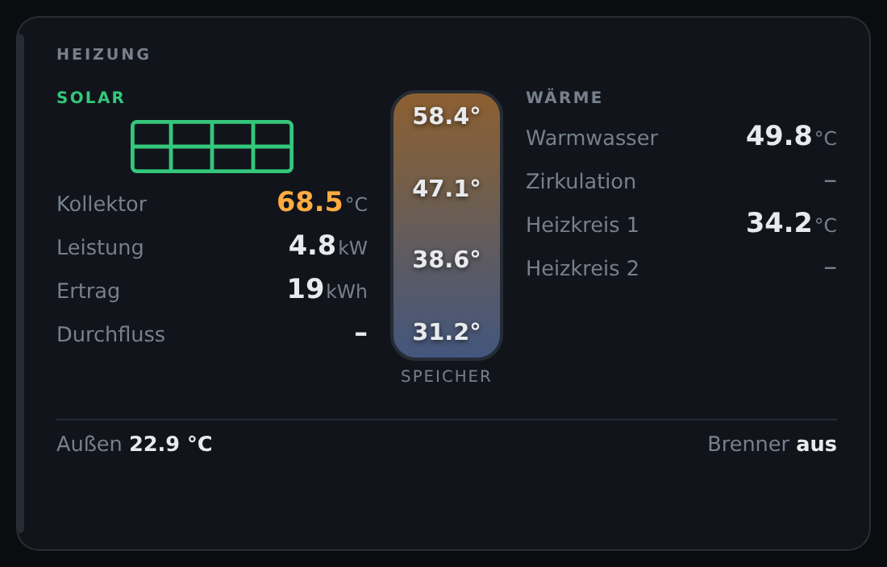
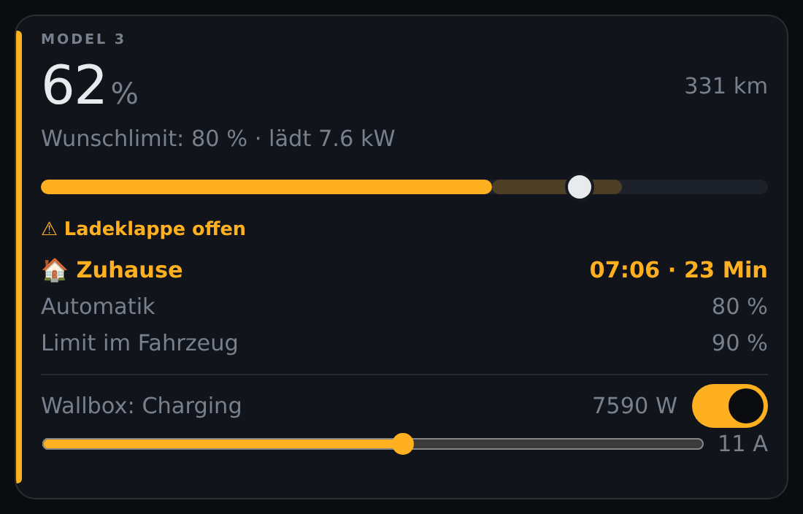
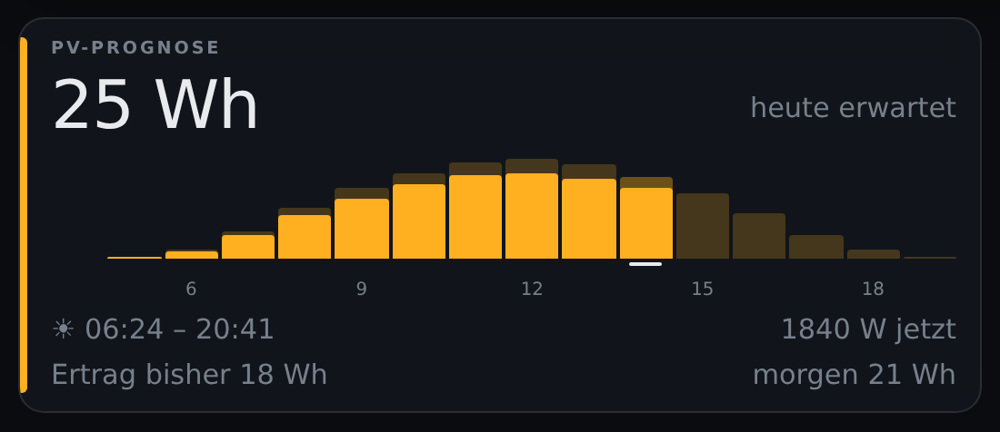
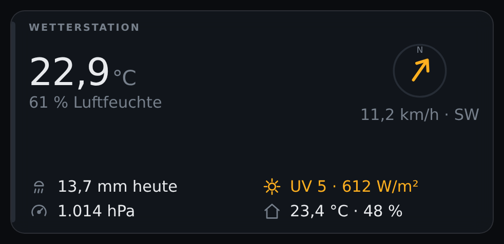
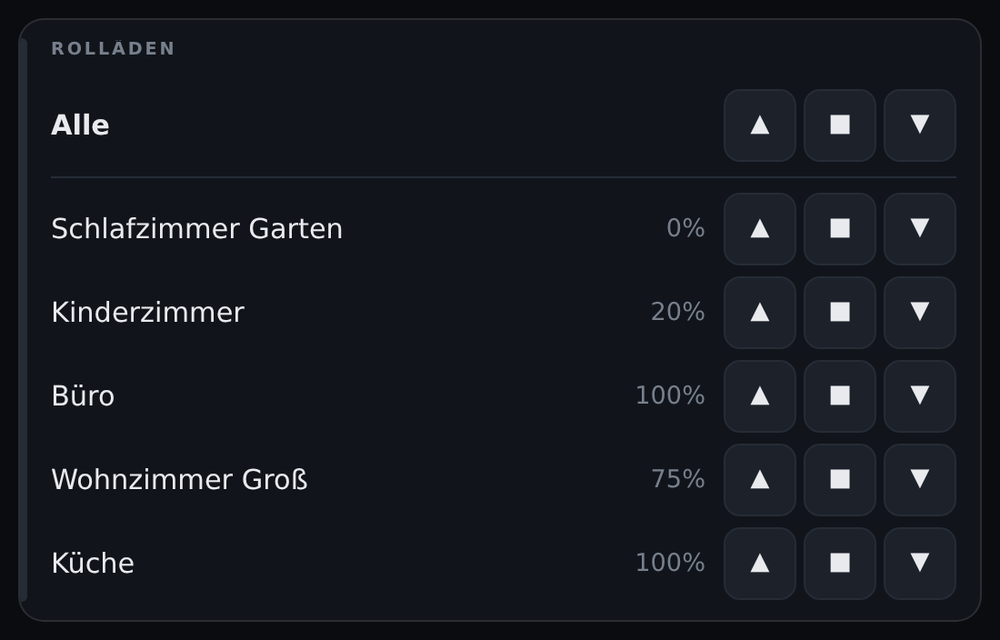

# FHEM-FHEMVIZ

Moderne, responsive **FHEM-Visualisierung** – Konfiguration vollständig im
FHEM-Standard („FHEM-Standard-first"). Ein System, zwei Betriebsarten:
**Tablet** (Touch, Raum-Tabs unten) und **TV/Kiosk** (bedienlos,
Szenen-Rotation, steuerbar per FHEM-Event).



Architektur & Konzept: [`CONCEPT.md`](./CONCEPT.md) ·
Änderungen: [`CHANGELOG.md`](./CHANGELOG.md) ·
Arbeitsweise am Repo: [`CLAUDE.md`](./CLAUDE.md)

> Vollständige Referenz aller Attribute mit Beispielen: die **FHEM-Hilfe** des
> Moduls (`commandref` → FHEMVIZ bzw. das `?` am Gerät). Dieses README ist der
> Überblick.

**Was FHEMVIZ nicht tut:** es kennt keine Geräte. Es liest, was FHEM über sich
erzählt — `PossibleSets`, `webCmd`, `genericDeviceType`, `eventMap`, `room`,
`group`, `sortby` — und macht daraus Kacheln. Kein Build, kein Node, kein npm:
die Oberfläche sind Web Components, die der Browser direkt lädt. Aktualisiert
wird über den FHEMWEB-Longpoll, es gibt kein Polling.

---

## Installation

```
update add https://raw.githubusercontent.com/ahlers2mi/FHEM-FHEMVIZ/main/controls_FHEMVIZ.txt
update all
reload 98_FHEMVIZ
```

Danach im Browser: `http://<fhem>:<port>/fhem/fhemviz/index.html`

## Schnellstart

```
define myViz FHEMVIZ
attr myViz devspec room=Wohnzimmer|Garage|Solar
```

Mehr ist nicht nötig – die SPA findet das Gerät automatisch, lädt alle
Geräte des `devspec`, gruppiert nach `room`/`group` und aktualisiert live
(kein Polling). Alles Weitere ist optional.

Sobald ein FHEMVIZ-Gerät definiert ist, erscheint im linken FHEMWEB-Menü
ein Eintrag **FHEMVIZ** (wie „Floorplans"), der direkt die Oberfläche öffnet.

## Konfiguration: das FHEMVIZ-Gerät

| Attribut | Werte | Wirkung |
|---|---|---|
| `devspec` | FHEM-devspec | **Pflicht.** Welche Geräte in der Sicht sind, z. B. `room=Dashboard.*` oder `d_garage_neu,mySolar.*` |
| `mode` | `tablet` (Default) / `tv` | Betriebsart; per URL übersteuerbar (`?mode=tv`) |
| `tvScenes` | `Raum:Sek,Raum:Sek` | Szenen-Rotation im TV-Modus, z. B. `Solar:30,Wohnzimmer:20,Garage:15`. Ohne Angabe: alle sichtbaren Räume à 20 s |
| `tvHeroSec` | Sekunden | Eigene Standzeit der Vollbild-Kachel (`vizHero full`) innerhalb der Szenenzeit; ohne Angabe teilen sich alle Seiten die Zeit gleichmäßig |
| `tvTouch` | Sekunden (Default 30, `0` = aus) | Touch-Übernahme im TV-Modus: Tipp auf den Schirm → bedienbare Tablet-Ansicht; nach `tvTouch` s ohne Aktion läuft die Rotation weiter (TV-Modus als Tablet-Bildschirmschoner) |
| `theme` | `auto` (Default) / `light` / `dark` | Farbschema; `auto` folgt dem System |
| `zoom` | `0.5`–`3` oder Prozent (`130`) | Standard-Skalierung für alle Browser dieses Geräts; `?zoom=` in der URL geht vor. Praktisch für Kiosk-Browser (Fully), die URL-Parameter verschlucken. Aktiver Zoom steht in der Statuszeile |
| `readonly` | `0` / `1` | Keine Bedienelemente (Gäste-/Wandmodus); im TV-Modus immer aktiv |
| `showRooms` | Regex-Liste | **Whitelist**: nur passende Räume erscheinen, Geräte ohne passenden Raum entfallen ganz. Für ein rein kuratiertes Dashboard: `FHEMVIZ->.*` |
| `hideRooms` | Regex-Liste | Räume ohne eigenen Tab/Abschnitt. Default: `System->.*,Homebridge,Alexa,FileLog,hidden` |
| `hideTypes` | TYPE-Liste | Geräte-TYPEs ohne Kachel. Default: `SVG,FileLog,notify,at,DOIF,watchdog,weblink,readingsGroup` |
| `hideStates` | Regex-Liste | Geräte, deren state komplett matcht, werden ausgeblendet. Default: `\?\?\?,unknown,initialized,defined,disabled,inactive` |
| `width` | 320–3840 | Feste Layout-Breite in CSS-Pixeln; die Seite wird in dieser Breite gerendert und bildschirmfüllend skaliert. Setzt `zoom` außer Kraft. Kleinere Breite = größere Darstellung |
| `skin` | `bento` / `zeilen` / … | Optik: `bento` = Kacheln (Wandtablet/TV), `zeilen` = Listenzeilen (Handy). Per URL übersteuerbar (`?skin=zeilen`) |
| `skinBlur` | `0` / `1` | Weichzeichnen hinter den Kacheln (nur mit Hintergrundbild sinnvoll) |
| `snap` | `kachel` (Default) / `gruppe` / `off` | **Rastendes Scrollen** auf Tablet/Handy: ein Wisch endet auf einer Kachelzeile bzw. auf einer Gruppenüberschrift, statt eine halbe Kachel unter der Kopfzeile stehen zu lassen. Im TV-Modus wirkungslos (der blättert). Per URL übersteuerbar (`?snap=gruppe`) |
| `background` / `backgroundDim` | URL / 0–100 | Hintergrundbild und wie stark es abgedunkelt wird |
| `statusBar` | `gerät[:reading[:einheit[:label[:farben]]]]`, kommasepariert | Dauer-Chips unter der Kopfzeile (Fenster, Batterie, Pool …); Tippen springt in den Raum des Geräts |
| `headerInfo` | wie `statusBar`, plus `icon=gerät:größe` | Werte groß in der Kopfzeile (Außentemperatur, Wetter-Icon) |
| `roomPrefix` | Default `FHEMVIZ->` | Raum-Präfix **dieser** Sicht; wird in Tabs und Überschriften abgeschnitten. Damit kann eine **zweite Sicht** eigene Räume benutzen (`Opa->Wohnzimmer` → Tab „Wohnzimmer") und im Haupt-Dashboard nicht auftauchen |
| `sound` | leer / `beep` / URL | **Ton**, wenn ein Bild (`set show`) oder eine Nachricht (`set msg`) hereinkommt. `beep` = eingebauter Zweiklang, keine Tondatei nötig. Achtung Autoplay-Sperre: nach einem Neuladen erst nach der ersten Berührung – in Fully die Medienwiedergabe erlauben |
| `pwa` | `1` / `0` (Default 1) | **„Zum Startbildschirm hinzufügen“**: Manifest wird zur Laufzeit erzeugt – `start_url` behält `?room=`/`?zoom=`/`?skin=` (die installierte App startet in der Ansicht, aus der sie angelegt wurde), der Name führt den Raum mit („FHEMVIZ Media“). Die Symbole stecken als `data:`-URI mit drin, damit sie auch hinter `basicAuth` beim Android-App-Bau ankommen. `0` = statisches `manifest.webmanifest` wie bisher |
| `flash` | `1` / `0` / `values` | Kurzes Aufleuchten bei Wertänderung (`values` = nur der Wert, nicht die ganze Kachel) |
| `disable` | `0` / `1` | Sicht abschalten |

**Set-Befehle** (Steuerung aus FHEM heraus):

```
set myViz scene <Raum> [Sekunden]     # Szene vorübergehend übernehmen (TV)
set myViz page  <Raum>|auto           # Seite dauerhaft umschalten
set myViz show  <url>|off [Sek]       # Bild/Webseite als Vollbild-Overlay
set myViz msg   <text>|off [Sek]      # Textbanner oben einblenden
```

Mehrere Sichten sind erlaubt: ein zweites `FHEMVIZ`-Gerät mit eigenem
`devspec`, eigenem `skin` und eigenem `roomPrefix` ergibt eine eigene Seite
(z. B. eine reduzierte Gäste-/Betreuungs-Seite), aufgerufen mit
`?device=<name>`. Der zuletzt gewählte Tab wird je Sicht gemerkt.

## Konfiguration: die visualisierten Geräte

FHEMVIZ liest zuerst die **Standard-Attribute** – wer seine Geräte sauber
pflegt, braucht nichts Neues:

| Standard-Attribut | Wirkung in FHEMVIZ |
|---|---|
| `room` | Tab/Szene (kommasepariert = Gerät erscheint in jedem Raum) |
| `group` | Karten-Gruppierung im Raum |
| `alias` | Anzeigename der Kachel |
| `sortby` | Reihenfolge in der Gruppe |
| `genericDeviceType` | Widget-Wahl (light/switch → Schalter, blind → Dimmer, …) |
| `webCmd` | Bedien-Buttons (z. B. `Auf:Zu:Lüften:Stop` → Aktions-Widget) |

Dazu drei **viz-Attribute** (global registriert, mit Dropdown an jedem Gerät):

| Attribut | Werte | Wirkung |
|---|---|---|
| `vizWidget` | siehe Liste unten | Widget-Typ erzwingen; übersteuert auch die Rausch-Filter (Gerät wird immer gezeigt) |
| `vizSize` | `1x1` / `2x1` / `1x2` / `2x2` | Kachelgröße im Raster; `2x2` = Hero-Kachel mit großer Schrift |
| `vizHide` | `1` / `0` | Gerät aus der Sicht ausblenden |
| `vizIcon` | `lampe` / `steckdose` / `lautsprecher` / `luefter` / `pumpe` / `tv` / `heizung` / `power` | **Symbol-Modus** für Schalter: großes Icon mittig, Name darunter, bernstein = an — aus der Ferne lesbar; Tippen auf die Kachel schaltet |
| `vizGroup` | Gruppenname(n), `-` = keine | Übersteuert `group` **nur im Dashboard** (FHEMWEB unberührt) — steuert, welche Kacheln zusammenstehen; `-` löst die Gruppe auf („Allgemein") |
| `vizReadings` | `reading[:Label[:Einheit[:Farbe[:bar]]]]`, kommasepariert | Kachelinhalt **direkt aus Readings** statt state-Parsing; erster Eintrag = Hauptwert (groß). Farben semantisch: `ok`/`grün`, `warn`/`orange`, `bad`/`rot`, `accent`, `blau`. Statt eines festen Namens auch **Schwellwerte** `farbe@[vergleich]schwelle`, mehrere mit `\|`, erster Treffer gewinnt (`bad@>=34\|ok@>=26\|blau@<24`). Die Schwelle darf eine Zahl oder der **Name eines anderen Readings** desselben Geräts sein, optional mit Versatz (`ok@>poolTemp`, `warn@>=poolTemp+3`). Flag `bar` = zusätzlicher Fortschrittsbalken (Skala 0–100, z. B. Autarkie-/Akku-Prozent). Gesetzt = state wird ignoriert, Gerät immer angezeigt |
| `vizHero` | `1` / `0` / `full` | Gerät als breiter **Blickfang** ganz oben im Raum (aus dem Raster gelöst). `full` = ganze sichtbare Fläche |
| `vizState` / `vizStates` | Reading / `muster:Label[:Farbe]` | Welches Reading den Zustand trägt bzw. Klartext + Farbe dafür (`error:Störung:bad`) — nützlich bei Modulen, die in `state` den letzten Befehl ablegen |
| `vizAlert` | `reading OP wert`, Komma = ODER | **Störung**: pulsierender roter Rahmen an der Kachel **und** Eintrag in der Hinweis-Leiste. OP: `> < >= <= = == != ~ !~` (`~` = Regex), Wert darf leer sein (`last_error!=` = „nicht leer") |
| `vizAgenda` | `hide=<Stunden>` | Terminliste: wie lange ein **abgelaufener** Termin noch stehen bleibt (Default 8, `0` = nie) |
| `vizText` / `vizImage` | Text mit `{reading}` / URL bzw. Reading | Freier Text bzw. Bild-Kachel |
| `vizFlow` / `vizChart` / `vizWatering` / `vizCar` / `vizCameras` | siehe FHEM-Hilfe | Konfiguration der Spezial-Kacheln (Energiefluss, Diagramm, Bewässerung, Auto/Wallbox, Kameras) |
| `vizVolumeMax` | Zahl | Deckelt den Lautstärkeregler der `mediagroup`-Kachel |
| `vizFlash` | `1` / `0` | Aufleuchten bei Wertänderung je Gerät übersteuern (zappelige Leistungskachel beruhigen) |

### Widgets

Der Typ wird aus `genericDeviceType`, `webCmd` und den `PossibleSets` erraten;
`attr <dev> vizWidget <typ>` erzwingt ihn.

**Grundtypen** — reichen für die meisten Geräte, meist ohne jede Angabe:

`switch` · `sensor` · `dimmer` · `shutter` · `contact` · `vent` · `actions` ·
`text` · `agenda` · `image` · `chart`

**Spezialkacheln** — für einen bestimmten Zweck gebaut. Die Bilder sind echte
Aufnahmen der Oberfläche:

| | |
|---|---|
| **`flow`** — Energiefluss. PV, Haus, Netz und Batterie mit laufenden Punkten in Flussrichtung; minus = entladen. Zuordnung über `attr <dev> vizFlow`.<br> | **`watertank`** — Regenwasseranlage als Schema. Füllhöhen in Litern, gestrichelt die Schwimmerhöhe, Rohre leuchten nur bei echtem Transport. Behälterzahl aus `ibcUsableVolume`.<br> |
| **`mealplan`** — Wochenplan: heute groß mit Foto, die übrigen Tage als Streifen. Würfeln, bewerten und Einkauf direkt aus der Kachel — Knöpfe nur für set-Befehle, die es wirklich gibt.<br> | **`solvis`** — Heizung: Schichtung im Speicher als Zylinder (S01/S04/S09/S03 von oben nach unten), dazu Solarkreis, Kollektor und Brenner.<br> |
| **`car`** — Ladestand als Balken, dessen **Griff das Wunschlimit ist** (Vorbild: die Tesla-App). Optional ein Fahrzeugbild oben, auf Wunsch je Ladezustand ein eigenes. Wallbox über `vizCar wallbox=<gerät>`. Liefert das Auto ein Fahrtziel, steht die **Ankunftszeit** dabei — nach Hause farbig hervorgehoben.<br> | **`forecast`** — PV-Prognose als Stunden-Balken: IST-Ertrag kräftig vor der blassen Prognose, Marker unter der laufenden Stunde. `TYPE=SolarForecast` wird automatisch erkannt.<br> |
| **`weather`** — Wetterstation (Ecowitt/GW3000): Außen und Innen, Wind, Regen, UV, Druck.<br> | **`shuttergroup`** — Rollläden aus einem `structure`: Master-Zeile „Alle" plus je Rollade Position und ▲■▼. Der gemeinsame Namensanfang fällt weg.<br> |

Dazu `watering` (Bewässerungs-Steuerung ohne Schema).

**Fahrzeugbild, auf Wunsch je Ladezustand.** Ein Bild für alle Fälle:

```
attr MQTT2_Tesla_Model3 vizCar wallbox=MQTT2_GOE,image=/fhem/www/tesla.png
```

Oder drei, dann wechselt das Bild mit dem Zustand — drei zugeschnittene und
**freigestellte** Beispielbilder liegen im Repo und kommen mit dem `update`
mit; ohne Hintergrund steht das Fahrzeug direkt auf der Kachel, egal welcher
Skin:

```
attr MQTT2_Tesla_Model3 vizCar wallbox=MQTT2_GOE,\
  image=laedt:/fhem/fhemviz/img/car/tesla-laedt.png|steckt:/fhem/fhemviz/img/car/tesla-steckt.png|frei:/fhem/fhemviz/img/car/tesla-frei.png
```

`laedt` = es läuft Leistung, `steckt` = Kabel dran ohne Leistung, `frei` =
nichts angesteckt. Fehlt einer der drei, gilt der erste angegebene — zwei
Bilder reichen also auch.

**Das Wunschlimit ist ein Minimum, keine Obergrenze.** Es ist der Ladestand,
der **immer** erreicht wird — unabhängig davon, wie die
Solarüberschuss-Regelung gerade entscheidet. Die blasse Strecke zwischen
Füllung und Griff ist deshalb nicht „vielleicht", sondern was auf jeden Fall
noch kommt; darüber wird der Balken grün. Nicht zu verwechseln mit „Limit im
Fahrzeug" — das ist die Obergrenze, bis zu der das Auto selbst lädt.

> **Der Balken rechnet durchgehend von 0 bis 100** (ab v0.37.5). Vorher
> übernahm der Griff die Spanne aus dem `setList`: bei
> `wish_charge_limit:slider,20,5,100` saß ein Limit von 25 % bei
> (25−20)/(100−20) = **6 %** der Schiene, während die Farbfläche daneben bei
> 25 % endete — zwei Skalen in einem Balken. Was das Gerät annimmt (Anfang und
> Schrittweite aus dem `setList`) begrenzt jetzt nur noch, wie weit sich der
> Griff ziehen lässt und welcher Wert gesendet wird.

**Kommt das Auto nach Hause?** Liefert das Fahrzeug Fahrtziel und Restzeit
(Tesla über ioBroker: `active_route_destination` und
`active_route_minutes_to_arrival`), zeigt die `car`-Kachel eine Zeile mit Ziel,
Ankunftszeit und Restminuten:

```
attr MQTT2_Tesla_Model3 vizCar wallbox=MQTT2_GOE,home=Im Nott|Zuhause|Home
```

Enthält das Ziel einen der `home=`-Texte, heißt die Zeile **„🏠 Zuhause"** und
wird farbig hervorgehoben — man sieht auf einen Blick, dass es heimkommt und
wann. Mehrere Schreibweisen mit `|` trennen ist sinnvoll, weil das Auto je nach
Eingabe die **Adresse** („Im Nott 35, 48301 Nottuln"), einen **POI-Namen**
(„Moubis Dülmen") oder den **Namen eines gespeicherten Ortes** („Zuhause")
meldet. Der Text sollte lang genug sein, um nicht danebenzugreifen: `Nott`
allein trifft auch jedes Ziel in *Nottuln*.

> **Die Frische entscheidet.** Die Route-Readings bleiben nach der Fahrt
> stehen; im Bestand lagen „7 Minuten bis Dülmen" zwei Tage lang im Gerät. Die
> Zeile erscheint deshalb nur, wenn der Zeitstempel der Restzeit jünger als
> 15 Minuten ist (`routeAge=<minuten>` ändert das, `routeAge=0` schaltet die
> Prüfung ab). Ohne Zeitstempel wird nichts gezeigt — eine erfundene
> Ankunftszeit ist schlimmer als keine.

**Gruppen-Kacheln** — EINE Kachel für ein `structure`-Gerät, mit einer Zeile
je Mitglied (die Mitglieder müssen im `devspec` liegen, dürfen aber per
`vizHide`/verstecktem Raum aus dem Raster raus):

| Widget | Inhalt |
|---|---|
| `shuttergroup` | Rollläden: Master-Zeile „Alle" + je Rollade Position und ▲■▼. Endlagen über `pct 0/100` (bei CUL_HM sind `up`/`down` **relativ**). Gemeinsamer Namensanfang fällt weg: „Rollade Wohnzimmer Garten" → „Garten" |
| `switchgroup` | Schalter mit Schiebeschalter je Zeile |
| `sensorgroup` | Messwerte je Zeile |
| `contact` (structure) | Fenster/Türen: „2 offen · 1 gekippt" + Mini-Symbol je Mitglied |
| `ventgroup` | Lüften/Kühlen mit sieben Stufen (−3 … +3), Farbe je Stufe über CSS-Variablen |
| `mediagroup` | Denon/HEOS/Spotify: An/Aus, Mute, Lautstärke, Quelle je Gerät |
| `cameragroup` | Kameras: Vorschaubild, Person erkannt, Akku, Bewegungserkennung an/aus |

**Beispiel Wechselrichter** (Readings statt stateFormat-Raten, mit Farben
wie im alten Solardashboard):

```
attr d_Wechselrichter_all vizReadings soc:Ladung:%:accent,pv_leistung:PV:W:ok,out_leistung:Haus:W:bad,netzleistung_all:Netz:W:ok,batterie_leistung:Batterie:W:warn
attr d_Wechselrichter_all vizSize 2x2
```

**Beispiel Müllkalender** (Terminliste im Agenda-Stil, nächster Termin
hervorgehoben):

```
attr rem_d_cal_muell vizWidget agenda
attr rem_d_cal_muell alias Termine
attr rem_d_cal_muell vizSize 2x2
```

**Mehrere Kalender in einer Kachel** (ab v0.37.8): `src=` legt die Termine
mehrerer Geräte zusammen und sortiert sie nach Datum. Die Beschriftung je Zeile
ist der `alias` des Quellgeräts, die Farbe steht als Kante links und als Kürzel
rechts:

```
attr rem_d_cal_google vizAgenda src=rem_d_cal_muell:ok,rem_d_cal_google:blau,rem_d_cal_familie:#c678dd
attr rem_d_cal_muell vizHide 1
attr rem_d_cal_familie vizHide 1
```

Farbnamen wie bei `vizReadings` (`ok|warn|bad|accent|blau`) oder eine CSS-Farbe.
`accent` ist eine schlechte Wahl für eine Quelle — das ist die Farbe für
„heute/morgen", und die färbt die **Fläche**; die Herkunft färbt nur die Kante.
Auf einer schmalen Kachel entfällt das Kürzel, sonst frisst es den Termin.

**Beispiel PV-Prognose** (`TYPE=SolarForecast` wird automatisch erkannt,
`vizWidget forecast` ist nur für andere Gerätetypen nötig): Stunden-Balkenchart
des Tages — IST-Ertrag kräftig vor der blassen Prognose, Marker unter der
laufenden Stunde — plus Sonnenzeiten, Peak-Stunde, aktuelle Leistung und
Morgen-Prognose:

```
attr Forecast vizSize 2x1
```

## Raum-Konvention `FHEMVIZ-><Name>`

Reine Dashboard-Räume (z. B. für TV-Szenen) legst du als Unterräume von
`FHEMVIZ` an — in FHEMWEB bleiben sie als eine zusammengeklappte Hierarchie
sichtbar, im Dashboard erscheint nur der Kurzname:

```
attr rem_d_cal_muell room Remote->Calendar,System->mcp_rw,FHEMVIZ->Termine
attr myViz tvScenes Solar:30,Wohnzimmer:20,Termine:15
```

- Tab/Szene heißt schlicht **„Termine"** (der Präfix wird ausgeblendet)
- In `tvScenes` und `set myViz scene …` genügt der **Kurzname** —
  `Termine` findet automatisch `FHEMVIZ->Termine` (exakter Name gewinnt,
  falls beides existiert)

**Widget-Auswahl** (Reihenfolge): `vizWidget` → `vizReadings` (→ Readings-
Kachel) → `genericDeviceType` → `webCmd` (reine on/off → Schalter,
`pct`/`dim` → Dimmer, sonst Aktions-Buttons) → PossibleSets-Heuristik →
Sensor-Kachel.

## TV-/Kiosk-Modus einrichten

Fernseher/Kiosk-Browser (Fully Kiosk, Chromium-Kiosk) bekommt als Start-URL:

```
http://<fhem>:<port>/fhem/fhemviz/index.html?mode=tv&device=myViz
```

Optional mit Startraum und Skalierung (siehe URL-Parameter):

```
http://<fhem>:<port>/fhem/fhemviz/index.html?mode=tv&device=myViz&room=Solar&zoom=1.3
```

Szenen-Rotation konfigurieren und per Event übernehmen lassen:

```
attr myViz tvScenes Solar:30,Wohnzimmer:20,Draußen:15

# Geräte-Event kapert den Schirm - ein ganz normales notify:
define n_tor_tv notify d_garage_neu:onoff:.* set myViz scene Garage 60
```

Der rote Rahmen signalisiert die Event-Übernahme; nach Ablauf kehrt die
Rotation automatisch zurück.

### Eine Kachel auf dem ganzen Schirm: `vizHero full`

`attr <gerät> vizHero full` (ab v0.35.3) lässt den Blickfang die **ganze
sichtbare Fläche** einnehmen statt nur eine Zeile — größte Schrift, Kachel auf
volle Höhe gestreckt. `full` ist genau der Wert, den auch die Auswahlliste des
Attributs anbietet (`0`, `1`, `full`):

```
attr bewaesserung room FHEMVIZ->Wasser
attr bewaesserung vizHero full
attr myViz tvScenes #uhr:20,Solar:30,Wasser:25
```

**Die anderen Kacheln des Raums bleiben.** Die Vollbild-Kachel belegt auf dem
Fernseher die **erste Seite** der Szene, danach blättert das vorhandene
Auto-Paging zu den übrigen weiter — die Kopfzeile zählt mit (`Draußen · 1/2`).
Auf Tablet/Handy füllt sie den ersten Schirm, der Rest steht darunter.

**Die Größe folgt Breite *und* Höhe** (ab v0.37.2), es gilt das Kleinere von
beidem. Wichtig für Kacheln mit festem Seitenverhältnis: `watertank` leitet die
Höhe seiner Zeichnung aus der Breite ab, und in einem breiten Browserfenster
wurde die Kachel dadurch höher als der Schirm (gemessen bei 1850×820: 926 px
Kachel in 780 px sichtbarer Fläche, die Seite scrollte 424 px). Jetzt wird die
Zeichnung kleiner und mittig gestellt, statt die Seite zu verlängern.

Ohne weitere Angabe teilt sich die Szenenzeit gleichmäßig auf die Seiten.
`tvHeroSec` am FHEMVIZ-Gerät gibt der großen Kachel eine **eigene Standzeit**:

```
attr myViz tvScenes Draußen:40,Küche:40
attr myViz tvHeroSec 25          # 25 s die große Kachel, 15 s der Rest
```

Je Seite bleibt mindestens eine Sekunde; ein zu großer Wert wird gekappt. Ohne
Vollbild-Kachel im Raum wirkt das Attribut nicht.

Mehrere `full`-Geräte eines Raums bekommen je eine Seite. Zurück geht es mit
`vizHero 1` (normales Band) oder `deleteattr <gerät> vizHero`.

### Uhr-Seite `#uhr` als Szene

`#uhr` (auch `#uebersicht`) ist kein Raum, sondern eine eigene Seite in der
Rotation: große Uhrzeit und Datum, darunter die Kennzahlen aus `headerInfo`
und je `statusBar`-Eintrag eine Zeile. Sie braucht keine eigene
Konfiguration — gezeigt wird, was für Kopfzeile und Statusleiste ohnehin
eingerichtet ist:

```
attr myViz tvScenes #uhr:20,Solar:30,Wohnzimmer:20
```

Auf dieser Seite entfällt die Kopfleiste, sonst stünde alles doppelt auf dem
Schirm; Titel und Statuszeile bleiben. Als einzige Seite rendert sie sich im
Sekundentakt neu, damit die Uhr läuft — dieser Takt wird beim Verlassen
abgeräumt (`set … scene`, `set … page`, Touch-Übernahme). Vor **v0.35.2**
lief er weiter und übermalte die neue Seite nach einer Sekunde wieder.

### Webseite/Kamerabild einblenden: `set myViz show`

Blendet eine URL als **Vollbild-Overlay über dem Dashboard** ein — ohne die
SPA zu verlassen (kein Reload, Live-Verbindung läuft weiter). Nach Ablauf
oder per Tipp verschwindet das Overlay:

```
set myViz show http://kamera/snapshot.jpg 20    # Kamerabild für 20 s
set myViz show http://<fhem>:8086/fhem/floorplan/WetterDash 60
set myViz show off                              # sofort schließen

# Türklingel blendet das Kamerabild auf allen Displays ein:
define n_klingel_tv notify MQTT2_DOORBELL:motion:.* set myViz show http://kamera/snapshot.jpg 20
```

Bild-URLs (`.jpg`/`.png`/…) werden als Bild gerendert, alles andere als
iframe. Hinweis: Fremdseiten können das Einbetten per `X-Frame-Options`
verbieten — Bilder und FHEM-eigene Seiten funktionieren immer.

> **Kamerabilder und der Browser-Cache.** Ein Schnappschuss liegt meist unter
> einer festen Adresse (`.../pic.jpg`): der Inhalt wechselt, die Adresse nicht.
> Damit der zweite Alarm nicht das erste Bild zeigt, hängt FHEMVIZ an
> **Bild**adressen einen wechselnden Parameter (`_viz=…`) an. Webseiten im
> iframe bleiben unangetastet, dort könnte ein zusätzlicher Parameter einen
> Token stören.

### Seite dauerhaft umschalten: `set myViz page`

Während `set myViz scene <Raum> [Sek]` den Schirm nur **vorübergehend** kapert,
schaltet `set myViz page <Raum>` die Anzeige **dauerhaft** um — ideal aus
notify/DOIF oder von Hand:

```
set myViz page Solar     # TV pinnt die Seite (📌 im Header), Tablet wechselt den Tab
set myViz page auto      # Pin aufheben, TV kehrt zur Szenen-Rotation zurück
```

- Die Rotation pausiert; läuft die Seite über, blättert das Auto-Paging
  zyklisch weiter (auf dem TV wird nie gescrollt)
- Ein `scene`-Event unterbricht auch eine gepinnte Seite und kehrt danach
  zu ihr zurück
- Das Reading `page` bleibt erhalten: neu verbundene Browser starten direkt
  auf dieser Seite (die URL-Parameter `?room=` gehen vor)
- Kurzname genügt, `FHEMVIZ->` wird automatisch probiert

## Störungen anzeigen: die Hinweis-Leiste

Jedes Gerät der Sicht mit zutreffendem `vizAlert` erscheint als roter Chip
unter der Kopfzeile („Sileno: trapped"). Ist nichts gestört, ist die Leiste
**gar nicht da**. Ein Tippen springt in den Raum des Geräts.

```
attr rem_SILENO vizAlert mower-error!~^(no_message|)$
attr Yuka       vizAlert device_1_status!=online,last_error!=
attr myViz      sound beep
```

Es gibt keine zweite Liste zu pflegen — gesammelt werden die `vizAlert`-
Attribute der geladenen Geräte. Ein Gerät, das nur **überwacht** und nicht
als Kachel gezeigt werden soll, kommt in einen per `hideRooms`
ausgeblendeten Raum; geladen wird es trotzdem. Damit lässt sich eine
`readingsGroup`-Statusseite (Bridges, Gateways, Bots) direkt nachbauen:

```
attr myViz hideRooms FHEMVIZ->Stuff,FHEMVIZ->Status
attr AHL2  room     System->CUL_HM,FHEMVIZ->Status
attr AHL2  vizAlert state!~^(connected|opened|initialized)$
```

## Layout in der Oberfläche ändern: `?edit=1`

Mit `?edit=1` in der URL bekommt jede Kachel eine kleine Werkzeugleiste,
unten erscheint eine Leiste mit *Speichern* / *Fertig*. Der Modus hat
**keinen eigenen Speicher** — er schreibt genau die Attribute, aus denen das
Layout ohnehin gebaut wird:

| Werkzeug | schreibt |
|---|---|
| ⠿ ziehen | `sortby` als 10, 20, 30 … (am Bildrand scrollt die Seite mit) |
| 1x1 … 2x2 | `vizSize` (im Streifen-Layout gesperrt: nur eine Spalte) |
| Hero | `vizHero` |
| Aus-/Einblenden | `vizHide` (ausgeblendete Kacheln bleiben im Modus blass sichtbar) |
| Raum | `room` — nur der `FHEMVIZ->`-Eintrag **dieses** Vorkommens, die übrigen Räume der Kommaliste bleiben unberührt |
| Gruppe | `vizGroup` (nie `group`) |
| ↺ | löscht `vizSize`, `vizHero`, `vizHide`, `sortby` |
| Speichern | `save` — FHEM hält Attribute nur im Speicher |

Im TV-Betrieb und bei `readonly 1` ist der Modus abgeschaltet.

## URL-Parameter

| Parameter | Wirkung |
|---|---|
| `?device=<name>` | Bestimmtes FHEMVIZ-Gerät (sonst: erstes `TYPE=FHEMVIZ`) |
| `?mode=tv` / `?mode=tablet` | Betriebsart übersteuern (für Kiosk-Start-URLs) |
| `?zoom=1.3` | Oberfläche skalieren (0.5–3, auch `130` als Prozent) — pro Gerät in der Start-URL, z. B. größer für den TV, kleiner fürs kleine Tablet. Auf Android/Fully Kiosk wird automatisch die native Viewport-Skalierung genutzt (CSS-zoom wird dort teils ignoriert) |
| `?room=Solar` | Startseite: TV beginnt die Szenen-Rotation mit diesem Raum (steht er nicht in `tvScenes`, läuft er einmalig zuerst), Tablet öffnet den Tab. Kurzname genügt, `FHEMVIZ->` wird automatisch probiert |
| `?width=1280` | Feste Layout-Breite (320–3840); setzt `?zoom=` außer Kraft |
| `?skin=zeilen` | Optik übersteuern (`bento` = Kacheln, `zeilen` = Listenzeilen fürs Handy) |
| `?flash=0` | Aufleuchten bei Wertänderung abschalten |
| `?edit=1` | Editiermodus (siehe oben) |

## Eigene Widgets (Plugin-API)

Eigene Widgets leben in `www/fhemviz/js/widgets/custom/index.js` — die Datei
gehört dir und wird von FHEM `update` **nie überschrieben** (sie steht nicht
in der controls-Datei). Buildfrei, keine Toolchain:

```js
import { registerWidget, FhemvizWidget } from "../registry.js";

class PoolWidget extends FhemvizWidget {
  render() {
    const t = this.plain((this.device.readings || {}).poolTemp ?? "–");
    return `<div class="card"><span class="label">${this.escape(this.displayName())}</span>
      <div class="value">${this.escape(t)}<span class="unit">°C</span></div>
      ${this.readingRowsHtml()}</div>`;
  }
}
registerWidget("pool", PoolWidget);
```

Aktivierung: `attr <gerät> vizWidget pool`. Die Basisklasse liefert
`plain()`, `escape()`, `readingRowsHtml()` (vizReadings), `sendCommand()`
und das Karten-CSS mit allen Design-Tokens.

## Struktur

```
FHEM/98_FHEMVIZ.pm     Helfer-Modul (Attribute, get config, set scene)
www/fhemviz/           buildfreie SPA (Web Components, kein Node/npm)
controls_FHEMVIZ.txt   FHEM-update-Manifest (wird per Workflow gepflegt)
CONCEPT.md             Konzept & Architektur
```

## Nach einem `update`: Version und Browser-Cache

Die SPA vergleicht beim Laden ihre eigene Version (`SPA_VERSION` in
`www/fhemviz/js/app.js`) mit der des Moduls (aus `get <viz> config`). Weichen
sie ab, steht in der Statuszeile:

```
Versionskonflikt: Modul v0.34.50 / Oberfläche v0.34.49
```

Die **zweite** Zahl kommt aus dem geladenen `app.js`. Ist sie älter, hängt der
Browser-Cache; ist sie neuer, wurde das Modul nach dem `update` nicht neu
geladen (`reload 98_FHEMVIZ`).

**FHEMVIZ hat keinen Service Worker.** Ein hängender Stand ist also immer der
normale HTTP-Cache, kein PWA-Cache – das macht ihn leichter loszuwerden:

- **Android, installierte App:** Einstellungen → Apps → FHEMVIZ → Speicher →
  *Cache leeren*. Nicht „Speicher löschen“, das wirft auch den gemerkten Tab
  und die übrigen `localStorage`-Einstellungen weg.
- **Android, Chrome:** Einstellungen → Datenschutz → Browserdaten löschen →
  „Bilder und Dateien im Cache“, Zeitraum „Letzte Stunde“ genügt.
- **iOS, gezielt:** Einstellungen → Safari → Erweitert → Website-Daten → den
  Eintrag des FHEM-Hosts nach links wischen und löschen. Trifft nur diese
  eine Seite, der Rest von Safari bleibt unangetastet.
- **iOS, Holzhammer:** Einstellungen → Safari → *Verlauf und Websitedaten
  löschen*. Wirft auch `localStorage` weg (gemerkter Tab, Zoom, Skin) – und
  zwar für alle Seiten.
- **iOS, installierte Verknüpfung:** löschen und über *Teilen → Zum
  Home-Bildschirm* neu anlegen. Sie merkt sich ihre Startadresse beim
  Anlegen; ein späteres Aufräumen des Caches ändert daran nichts.
- **Desktop:** Strg+F5.

Zur **Unterscheidung** taugt ein privater Tab: er lädt an jedem Cache vorbei.
Steht dort keine Konfliktmeldung, war es der Cache; steht sie auch dort, ist
eine der vier Versionszahlen (siehe unten) tatsächlich verschieden.

Ein `?x=1` an der URL hilft **nicht** – das umgeht den Cache nur für
`index.html`. Die Ladekette (`app.js` und die rund 30 Module, die es
importiert) trägt keine Versionskennung, wird also weiter aus dem Cache
bedient.

> **Beim Veröffentlichen:** die Versionszahl steht an vier Stellen –
> Kopfkommentar und `$FHEMVIZ_VERSION` in `98_FHEMVIZ.pm`, die Ausgabe von
> `get config`, und `SPA_VERSION` in `app.js`. Wird eine vergessen, meldet
> die Oberfläche bei *jedem* Laden einen Versionskonflikt, und der Hinweis
> auf den Cache führt in die Irre.

## Nach einem FHEM-Neustart: der csrfToken

FHEMWEB würfelt bei jedem Start einen neuen `csrfToken`. Ein Tab, der schon
offen war – das Wandtablet also praktisch immer – kennt nur den alten. Der
Longpoll (`?inform=`) braucht keinen Token und verbindet sich brav neu, die
Kopfzeile sagt weiter **live**. Jeder `?cmd=`-Aufruf wird dagegen mit
`400 Bad Request` abgewiesen: Resync, Diagramme und **alle Schaltbefehle**
laufen ins Leere. Von außen sieht das aus wie „das Tablet hat die Verbindung
verloren“. Im FHEM-Log steht dazu:

```
FHEMWEB WEB CSRF error: csrf_958391631924104 ne csrf_905432197403753
  for client WEB_192.168.10.87_53298 / command jsonlist2 room=FHEMVIZ->.*
```

Seit **v0.34.52** heilt die SPA das selbst. FHEMWEB hängt den aktuellen Token
als Header `X-FHEM-csrfToken` an *jede* Antwort – auch an die 400er, mit der
es gerade abgewiesen hat. Der Client übernimmt ihn von dort und wiederholt den
Befehl einmal; zusätzlich zieht er ihn bei jedem Longpoll-Reconnect nach, also
schon vor dem ersten Fehlversuch. Ein Neuladen der Seite ist nicht mehr nötig.

Zwei Nebenwirkungen desselben Problems sind mit behoben:

- Ein abgewiesener `set`-Befehl kam vorher als normaler Text zurück und galt
  als Erfolg. Jetzt wirft `command()` bei einer Fehlerantwort.
- Schlägt der Resync (alle 3 min) zweimal hintereinander fehl, steht in der
  Kopfzeile **„Daten veraltet“** statt „live“ – eingefrorene Werte bei grüner
  Statuszeile sind sonst nicht zu erkennen.

Ebenfalls ab v0.34.52: Wird der Tablet-Bildschirm wieder wach oder kommt das
WLAN zurück (`visibilitychange` / `online`), werden Longpoll und Daten sofort
erneuert, statt bis zu 2,5 Minuten auf den Watchdog zu warten.

## Was noch offen ist

Kein Fahrplan mit Terminen — eine Liste dessen, was bekannt fehlt oder klemmt.
Was fertig ist, steht im [`CHANGELOG.md`](./CHANGELOG.md).

**Bekannte Grenzen**

- **Die Ladekette trägt keine Versionskennung.** `index.html` → `app.js` → die
  rund 30 Module dahinter werden vom Browser normal gecacht; nach einem
  `update` hilft nur Nachladen (siehe Abschnitt oben). Ein Versionsanhang an
  den Imports würde das dauerhaft erledigen.
- **`eventMap` in Perl-Notation** (`eventMap {…}`) kann der Browser nicht
  auswerten — dort bleibt der Rohwert stehen. Die Listenform funktioniert.
- **`vizHero full` ist auf einen Schirm zugeschnitten.** Die Kachel selbst
  bekommt genau eine Seite; passt ihr *Inhalt* nicht hinein (viele feste
  Zeilen bei geringer Bildschirmhöhe), schneidet die Karte unten ab statt zu
  blättern. Der Rest des Raums ist davon nicht betroffen, der wird geblättert.
- **Kein Service Worker**, also kein Offline-Betrieb. Bewusst so — ein
  hängender PWA-Cache wäre schwerer loszuwerden als der HTTP-Cache.

**Ideen**

- Weitere Skins; `zeilen` und `bento` sind da.
- Widget-Vorschau im Editiermodus (`?edit=1`), damit ein Typwechsel nicht
  blind passiert.
- Der Editiermodus kennt für `vizHero` nur an/aus — `full` muss per `attr`
  gesetzt werden, weil ein Knopf mit drei Zuständen unklar wäre.

## Lizenz

GPL v2 oder höher (wie FHEM).
